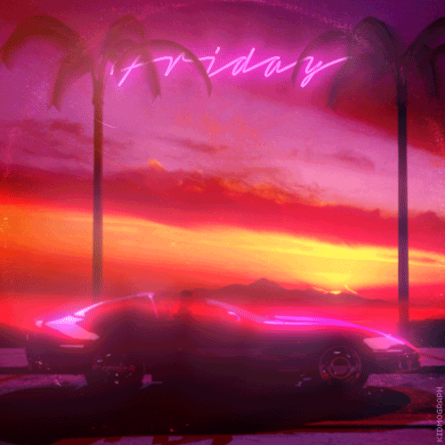
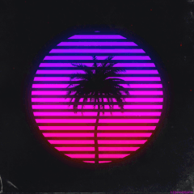

<h1 align="center">
   💜 LIST FULL OF SPEED AND DANGER 🚘
  

	
	 
	 
  ⍺
   
  early development state
</h1>

## Table of contents

* [Aesthetic](#aesthetic)
  * [Outrun](#outrun)
  * [Vaporwave](#vaporwave)

---

# Aesthetic

## Outrun

>*Outrun is a 1980s-themed retrofuturistic visual art and music style associated with the electronic genres electro, synthwave, futuresynth, new retrowave and vaporwave. The style is named after the iconic 1986 arcade racing game Out Run*[...](http://knowyourmeme.com/memes/cultures/outrun)

<h1 align="center">
  

	
	 
	 
</h1>

* [Wikipedia](https://en.wikipedia.org/wiki/Out_Run)
* [Knowyourmeme](http://knowyourmeme.com/memes/cultures/outrun)
* Reddit
  * [/r/Outrun](https://www.reddit.com/r/outrun/)

---

## Vaporwave

>*Aesthetic, often stylized as a e s t h e t i c, refers to retro-inspired visual art and music associated with the vaporwave subculture, which typically include Japanese lettering and nostalgic themes from 1980s and 1990s computer operating systems and video game consoles. Additionally, the term is widely associated with the 2012 vaporwave song “リサフランク420 / 現代のコンピュー” by Macintosh Plus*[...](http://knowyourmeme.com/memes/cultures/outrun)

<h1 align="center">
  

	
	 
	 
</h1>

* [Wikipedia](https://en.wikipedia.org/wiki/Vaporwave)
* [Knowyourmeme](http://knowyourmeme.com/memes/cultures/vaporwave)

---

> Click any content in list to visit source/author page